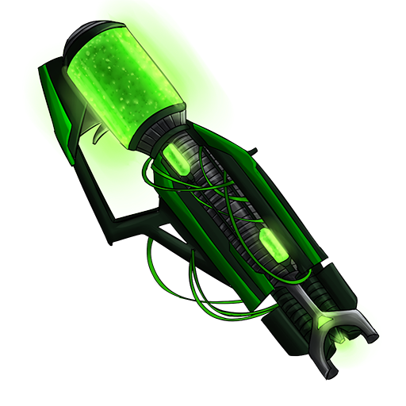

# Last Stand

# Zombie Defense Game

## How to Play

Welcome to the Zombie Defense Game! This guide will help you understand the game mechanics, the powers of different guns, preparation time, power-ups, and types of zombies you'll encounter.

### Game Objective

Your primary objective is to survive waves of incoming zombies by strategically placing blocks and mines, using your character's abilities, and leveraging automated defenses and raining powerups.

### Controls

- **Movement**: Use the arrow keys or WASD to move your character.
- **Place Block**: Click the "Place Block" button to place a block where your character is standing (only during preparation time).
- **Place Mine**: Click the "Place Mine" button to place a mine where your character is standing (only during preparation time).
- **Switch Guns**: Use 1,2,3 keys to switch between guns.

### Preparation Time

- Before each wave of zombies, you have a **preparation time** to set up your defenses.
- During preparation time, you can:
  - **Place Blocks**: Up to 2 blocks to create barriers.
  - **Place Mines**: Up to 3 mines to damage zombies when they step on them.
- Use the countdown timer to keep track of the remaining preparation time. -**Mines**: Explode upon contact with zombies, releasing 50 bullets with random velocity and gravity. **Mines Placed on Boxes may not work**

### Auto Gun

- **AutoGun**: An automated gun placed with an operator in the balcony.
  - **Rotation**: The AutoGun rotates 360 degrees to target zombies.
  - **Shooting Mechanism**: Shoots a burst of 7 bullets every 5 seconds, aiming towards a random zombie.
  - **Damage**: Each bullet inflicts 5 points of damage on zombies.

### Types of Guns

## 1. Normal Gun

- **Name**: Normal Gun
- **Image**: 
- **Bullet Velocity**: 20
- **CoolDown Time**: 20 ms
- **Damage**: 10
- **Recoil**: 10
- **Bullet Gravity**: 0.65
- **Special Abilities**: None

## 2. Shotgun

- **Name**: Shotgun
- **Image**: 
- **Bullet Velocity**: 15
- **CoolDown Time**: 750 ms
- **Damage**: 25
- **Recoil**: 30
- **Bullet Gravity**: 1
- **Special Abilities**: Shoots 3 bullets in a spread pattern with moderate recoil.

## 3. Rifle

- **Name**: Rifle
- **Image**: 
- **Bullet Velocity**: 30
- **CoolDown Time**: 750 ms
- **Damage**: 50
- **Recoil**: 50
- **Bullet Gravity**: 0.5
- **Special Abilities**: High range and damage, but also high recoil.

### Power-ups

Power-ups provide temporary boosts and advantages. Collect them to enhance your survivability and firepower.

- **Rapid Fire**
  - **Effect**: Decreases the fire rate of all guns by 3x for 10 seconds.
  - 
- **High Jump**
  - **Effect**: Increases jump power for 10 seconds.
  - 
- **Health Power-up**
  - **Effect**: Restores 50 hitpoints, up to a maximum of 100.
  - 
- **Bullet Rain**
  - **Effect**: Spawns 55 bullets falling from the sky.
  - 
- **Gun Damage Increase**
  - **Effect**: Doubles the damage of all guns for 10 seconds.
  - 

### Types of Zombies

- **Regular Zombies**: Standard zombies with moderate speed and health. Hp -100, Damage - 7.
- **Box Bypassing Zombie**: Tall Zombies that can bypass Boxes. Hp - 175, Damage - 10
- **Mother Zombie** : Mother of all zombies - spawins a bat every 60 seconds. Hp - 175, Damage - 10
- **Bat** : Hp - 1, Damage - 3

### Strategy Tips

- **Block Placement**: Strategically place blocks to create chokepoints and slow down zombie advances.
- **Mine Placement**: Place mines in high-traffic areas where zombies are likely to step.
- **AutoGun Positioning**: Ensure the AutoGun has a clear line of sight to maximize its effectiveness dont place boxes in their way!.
- **Keep Moving**: Stay mobile to avoid being cornered by zombies.
- **Collect Power-ups**: Regularly collect power-ups to maintain your health and ammunition.

By understanding these mechanics and using them to your advantage, you'll increase your chances of surviving each wave of zombies. Good luck, and stay vigilant!
